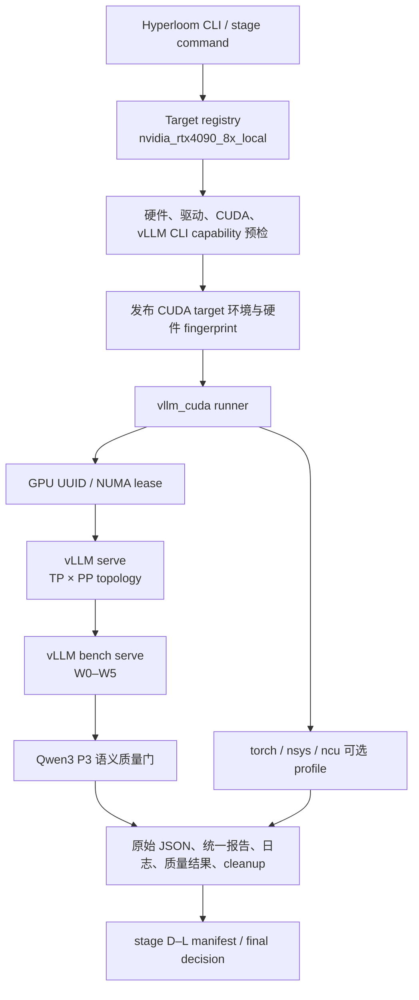

# Hyperloom NVIDIA/vLLM 接入与优化实验完整报告

**报告日期：2026-09-15**
**适用范围：单机 8×NVIDIA GeForce RTX 4090、CUDA 13.0、本地 Qwen3-32B、vLLM**
**报告性质：内部项目进展与技术验收记录**

## 1. 管理摘要

本轮完成了 Hyperloom 在本机 NVIDIA/CUDA 环境上的 vLLM 接入和一轮受控优化闭环。工程不再把 NVIDIA 当作 AMD/ROCm 的参数别名，而是新增独立的 CUDA target、vLLM benchmark backend、硬件与 CLI capability 预检、GPU lease、质量门、profile/Nsight 流程和可恢复实验 campaign。

已验证的能力包括：Qwen3-32B 的多 GPU 启停与清理、W0–W5 serving 基准、Qwen3 P3 语义质量门、torch profile、Nsight Systems 时间线、Nsight Compute 受限 kernel 计数器、配置搜索、GPU rank mapping/NUMA 审计，以及来源绑定的 vLLM Python 源码候选实验。所有服务运行均保存原始 vLLM JSON、统一 benchmark artifact、日志、质量结果、硬件/模型/配置/工作负载指纹和清理状态。

本轮**没有**得到可以保留的端到端性能优化。配置、PP 通信、NUMA、TP/PP 拓扑和 metadata cache 候选均在吞吐、P99 或联合门槛处回退。当前受控基线保持为 Qwen3-32B 的 TP2/PP4、BF16、max model length 2048，并使用：

```text
--gpu-memory-utilization 0.70 --safetensors-load-strategy prefetch
```

这不代表 TP2/PP4 在所有模型、硬件或业务负载上最优；它只是在本报告固定的硬件、模型、工作负载和验收规则下，没有候选通过最终保留条件。`current_best` 没有写入 NVIDIA 优化叠加层。

| 类别 | 结论 |
|---|---|
| NVIDIA 接入 | 已完成：独立 target、vLLM CUDA runner、预检、GPU lease、质量门、artifact 和恢复边界均已建立。 |
| Profile 与 Nsight | 已完成：单卡、TP1/PP8、TP2/PP4 均完成实际 trace/计数器验收；profile 数据不参与性能保留。 |
| 配置优化 | 已完成筛选；没有候选在 W2/W5 吞吐和 P99 联合门槛下保留。 |
| 源码与 kernel | 已完成受限归因和首个源码候选；没有通过端到端筛选的补丁。 |
| 当前生产性结论 | 仅可使用受控基线；不可宣称本轮获得 NVIDIA 端到端性能收益。 |

## 2. 接入方案：Hyperloom 如何支持 NVIDIA/vLLM

### 2.1 设计原则

NVIDIA 的执行路径与 AMD/ROCm 运行时不同，因此接入采用独立 target 和 backend，而不是在现有 AMD 枚举上增加条件分支。目标是让每个一次性 benchmark 都有明确的运行时身份、物理 GPU 身份、服务进程所有权、质量结果和清理责任。

本机 target 为 `nvidia_rtx4090_8x_local`。其目标合同要求：

- 8 张 `NVIDIA GeForce RTX 4090`，compute capability `8.9`，每张至少 24 GiB；
- CUDA runtime，默认 CUDA home 为 `/usr/local/cuda-13.0`；
- 使用 capability-validated 的 vLLM `serve` 与 `bench serve` CLI，而不是绑定某个包版本白名单；
- 仅支持单机。多机路径明确拒绝，避免把本地端口和 lease 模型误用到分布式环境；
- 默认开放 baseline、config explore、sweep 与 report。profile/trace_analysis 只在显式 profile target、工具预检和独立服务生命周期下开放；源码、kernel、量化和多机能力不自动对通用优化循环开放。

### 2.2 执行架构



### 2.3 Target、预检和环境发布

`src/hyperloom/inference_optimizer/target_registry.py` 定义 NVIDIA target。选择该 target 后，预检会发现并校验：GPU 名称/数量/compute capability/显存、driver、CUDA 工具链、PyTorch CUDA、NCCL、vLLM 版本与实际 CLI flag surface，并把结果序列化为硬件 fingerprint。runner 只有在以下条件同时满足时才执行：

1. `HYPERLOOM_TARGET=nvidia_rtx4090_8x_local`；
2. `HYPERLOOM_TARGET_RUNTIME=cuda`；
3. 硬件 fingerprint 的 target id 和 SHA-256 均有效；
4. benchmark framework 为 `vllm`；
5. 模型、TP/PP/world size、可见 GPU 和 CLI capability 均与合同一致。

`configure_target_environment` 还会设置 CUDA home、CUDA backend、禁用 ROCm 可见设备环境变量，并使本机 CUDA benchmark 不依赖 Ray serving actor。这样可以保留 runner 自己的 `CUDA_VISIBLE_DEVICES` 顺序、GPU lease 和进程组清理语义。

### 2.4 vLLM CUDA runner

`src/hyperloom/orchestrator/actions/executors/vllm_cuda_runner.py` 是本机 NVIDIA 执行面。它将 YAML 物化为固定 launch plan，并负责：

- 根据 TP×PP 选择 GPU index、UUID 和 NUMA node；
- 在 coordinator SQLite 中获取仅属于本次运行的 GPU lease；
- 启动 vLLM `serve`，等待 readiness，再启动 vLLM `bench serve`；
- 保存 server argv、bench argv、child environment、端口、fingerprint 与 raw result；
- 采集 NVML 显存摘要；
- 在正常结束、失败、超时或中断后仅清理本 runner 创建的进程组、PID、端口和 lease，不扫描或杀死其他用户的 GPU 作业；
- 写入 `vllm_cuda_benchmark.json` 和兼容的 `benchmark_report.json`。

服务参数和 workload 被显式持久化。profile 时 runner 使用独立的新鲜服务，避免复用服务污染 trace；普通 benchmark 可以使用本地服务生命周期复用，但只限单机、非 profile 场景。

### 2.5 质量门与测量产物

除非某阶段明确是 smoke，Qwen3-32B campaign 使用 `qwen3_p3` 质量套件。它覆盖中英文、长短 prompt、thinking/non-thinking 用例，检查非空 completion 和光合作用反应物/产物等语义组。质量结果写入 `quality_cases.json` 与统一 artifact；即使 HTTP 请求成功，语义不完整也会使候选失败。

每次 benchmark 的核心产物为：

| 产物 | 用途 |
|---|---|
| `vllm_cuda_benchmark.json` | 统一的吞吐、请求、P50/P90/P99、质量、GPU 内存、topology、fingerprint 和清理结果。 |
| `benchmark_report.json` | 与既有 Hyperloom 报告面兼容的摘要。 |
| `vllm_benchmark_raw.json` | vLLM 原始 bench serve 输出。 |
| `server.log`、client stdout/stderr | 启动、NCCL、profile、请求与错误诊断。 |
| campaign manifest/final JSON | 每个步骤、候选、resume 合同、裁决和证据路径。 |

### 2.6 Profile、Nsight 与源码实验边界

- **torch profile**：使用 vLLM 原生 profiler；用于 kernel 与执行路径诊断，不作为 baseline 或 KEEP 收益。
- **Nsight Systems**：采集 CUDA、NVTX、OS runtime 事件，按实际 worker PID、rank、GPU UUID 和时间窗口分析通信、copy、idle 与热点。
- **Nsight Compute**：仅针对 Nsight Systems 选定的精确 kernel 名称和相关 worker/rank 运行。样本需匹配模型、硬件、workload、serving、quality、grid/block 与 GPU UUID。
- **源码候选**：从当前 vLLM wheel 的 immutable revision 和 SHA-256 建立 campaign 私有 worktree/venv，验证 Python import 路径和原生扩展哈希。临时诊断或候选补丁结束后恢复源码；未通过的补丁不会进入工程源码或启动参数。

## 3. 实验协议与裁决规则

### 3.1 固定实验对象

除有意比较拓扑的阶段 J 外，主要实验固定为：

| 项目 | 设置 |
|---|---|
| 硬件 | 单机 8×RTX 4090，两个 NUMA node，无 NVLink 作为前提。 |
| 模型 | 本地 `/data/ygw/models/Qwen3-32B`，BF16。 |
| 服务拓扑 | TP2/PP4，world size 8。 |
| 最大长度 | 2048。 |
| 基础服务参数 | `--gpu-memory-utilization 0.70 --safetensors-load-strategy prefetch`。 |
| 质量 | `qwen3_p3`，每次服务启动执行。 |
| 工作负载 | W0–W5，覆盖低时延、decode、通用、prefill、混合和高并发饱和场景。 |

W2 是通用 serving 筛选负载：ISL 512、OSL 128、并发 4、100 prompts。W5 是高并发饱和筛选负载：ISL 512、OSL 128、并发 16、160 prompts。W0–W4 用于完整复验时的全负载保护。

### 3.2 联合门槛

筛选与最终复验不只比较一个吞吐数字：

1. W2 和 W5 均须有**严格正**吞吐增益；
2. TTFT、TPOT、E2EL 的 P99 不得高于筛选 baseline 的 105%；
3. 所有请求完成、无失败请求、Qwen3 P3 质量通过、cleanup 成功；
4. 若进入最终阶段，三次成对 W0–W5 复验中，W2/W5 几何平均增益还必须严格高于 `max(3%, 2×baseline CV)`；其他 workload 不得超过允许噪声带下降。

因此，单次 profile hotspot、吞吐增加但 TTFT 恶化、或功能正确但无正吞吐增益，都不能被写为可保留优化。

## 4. 接入与验收阶段 A–C

### 阶段 A：工程接入与可运行性

阶段 A 建立 NVIDIA target 与执行路径，保持既有 AMD 路径不被 CUDA runner 混用。安装脚本对 `vllm_cuda` 跳过 ROCm/kernel-agent 专属依赖钩子；benchmark backend 路由到 vLLM CUDA runner；CLI 会在 target 预检通过后发布 CUDA 环境与 fingerprint。

此阶段同时验证：Qwen3-8B 实际示例、Qwen3-32B 服务启动/停止、GPU lease、进程组清理、取消/恢复报告和原有 CPU/AMD 路径回归。示例入口位于：

```text
examples/hyperloom-qwen3-8b-nvidia-3h/run_example.sh
```

### 阶段 B：vLLM 原生 torch profile

阶段 B 接入原生 vLLM torch profiler。验收覆盖单卡、Qwen3-32B TP1/PP8 和 TP2/PP4；要求每个相关 rank 真正生成 CUDA kernel trace、服务 profile start/stop 被确认、trace health 完整。profile 吞吐被明确标记为诊断数据，不能写入 `current_best`。

### 阶段 C：Nsight Systems 与 Nsight Compute

阶段 C 实现独立的时间线与 roofline 执行器。为避免早期跨运行窗口漏采，最终流程固定为 warmup → 原生 profile start → 完整有界请求 → stop；不再用上一轮 execution step 推断下一轮采样窗口。TP 场景按 worker PID 和设备过滤 NCU，避免所有 rank 同时注入造成停滞。

最终验收包括：

| 验证 | 结果 |
|---|---|
| TP2/PP4 连续三轮 | 72 个有效逐 kernel NCU 样本，每轮在 45 分钟内完成。 |
| Qwen2.5-3B 单卡 | 3 次 NCU、9 个有效样本。 |
| Qwen3-32B TP1/PP8 | 3 次 NCU、51 个有效样本。 |
| Qwen3-8B 实例 | 自动 baseline → nsys → 三次 ncu → state/report；profile 不改变 baseline/current best。 |
| 取消与清理 | worker、GPU lease、端口和 PID 文件均能由受控流程回收。 |

阶段 C 的完整实现与证据见 `docs/nvidia-integration-plan.md` 的“TP2/PP4 ncu 修复验收”章节。

## 5. 优化实验与结果

### 5.1 结果总表

| 阶段 | 候选/审计对象 | 关键结果 | 最终裁决 |
|---|---|---|---|
| D | 调度与配置组合 | `max-num-batched-tokens`、`max-num-seqs`、memory utilization 的固定候选均未通过 W2/W5 筛选。 | `reverted` |
| E | PP sampled-token broadcast coalescing | W2 吞吐 -1.217%，TTFT P99 超 5%；W5 吞吐 -3.508%，TTFT/E2EL P99 超 5%。 | `reverted` |
| F | decode GEMV kernel 资格 | W2/W5 GEMV 占比低于 10%，带宽效率 92.08%/91.81%，已接近带宽上限。 | `no_eligible_kernel` |
| G | PP P2P overlap | SendRecv GPU 时间占 26.4046%，但最大 PP 边界窗口仅 0.1329%，低于 1% 门槛。 | `stopped_no_eligible_p2p_window` |
| H | GPU rank mapping | 默认 mapping 得分 PP `(2,18,5)`、TP `(0,6,2)`；没有严格支配映射。 | `stopped_default_mapping_pareto_optimal` |
| I | `--numa-bind` | W2 没有严格正吞吐增益。 | `reverted` |
| J | TP4/PP2、TP1/PP8 | TP4/PP2 吞吐增加但 TTFT P99 大幅回退；TP1/PP8 W2 吞吐下降。 | `reverted_no_topology_candidate_passed_screening` |
| K | TTFT 归因 | PP metadata receive 成为可测热点。 | `qualified_metadata_cache_candidate` |
| L | PP tensor metadata cache | 功能、P3 和 P99 通过；W2 吞吐 -0.0164%，无正收益。 | `reverted_no_positive_w2_gain` |

### 5.2 阶段 D：配置优化

阶段 D 是受限的、测量驱动的配置搜索，而不是通用 agent 任意调参。候选只包括：

- `--max-num-batched-tokens 4096`；
- `--max-num-batched-tokens 8192 --max-num-seqs 16`；
- 上述 8192 配置配合 GPU memory utilization 0.80 或 0.85。

它保留 BF16、CUDA Graph、默认 attention/KV 路径、prefix cache、chunked prefill 和基础服务参数；不以 `--enforce-eager` 或量化等不等价 baseline 制造收益。所有候选均未同时满足 W2/W5 严格正增益和 P99 约束，未进入三轮 W0–W5 复验。

最终证据：

```text
/data/ygw/llm_sim/benchmark_results/qwen3-32b-tp2-pp4-stage-d/stage_d_final.json
```

### 5.3 阶段 E：PP broadcast coalescing 源码候选

阶段 E 使用当前 vLLM wheel 来源绑定的私有 worktree。候选将 PP sampled-token 通信中原有的两次 broadcast 合并，同时保持 tensor、side stream、event、队列与请求释放过滤语义。候选首先经 W2/W5 筛选，随后完成三轮配对 W0–W5 验证。

最终复验显示：

- W2 throughput gain 为 `-1.2174%`，TTFT P99 从 681.84 ms 增至 811.14 ms；
- W5 throughput gain 为 `-3.5082%`，TTFT P99 从 1892.74 ms 增至 2323.35 ms，E2EL P99 也超过 5%；
- W4 吞吐下降超过允许噪声带。

候选恢复，未推广。最终证据：

```text
/data/ygw/llm_sim/benchmark_results/qwen3-32b-tp2-pp4-stage-e/stage_e_validation_final.json
```

### 5.4 阶段 F：decode GEMV kernel 资格确认

阶段 F 不直接写 Triton/CUDA kernel；它先证明热点是否足以值得 kernel authoring。W2/W5 在 eager + layerwise NVTX 诊断下关联 GEMV 的源路径、形状和带宽效率，再要求热点占比至少 10%、microbenchmark CV 不超过 5%、带宽效率低于 85%。

实际结果中 GEMV 的归因占比低于 10%，且 NCU 带宽效率为 W2 `92.08%`、W5 `91.81%`。该路径已经接近实测带宽上限，继续手写 kernel 缺少预期空间，因此停止在资格阶段。

```text
/data/ygw/llm_sim/benchmark_results/qwen3-32b-tp2-pp4-stage-f/stage_f_final.json
```

### 5.5 阶段 G：PP P2P overlap

阶段 G 先在私有 vLLM worktree 中加入临时 NVTX 标记，测量“上一轮非阻塞 PP send 的等待到当前 irecv 提交”的窗口。只有 SendRecv GPU 时间至少 10%，且至少一个 PP 边界窗口至少占 capture window 的 1%，才会尝试将 wait 延后到 irecv 提交之后。

实测 SendRecv 占 GPU kernel 时间 `26.4046%`，通过第一项门槛；但 8 个 rank 的最大标记边界仅占 `0.1329%`，远低于 1%。说明通信 kernel 本身并不等价于可重叠、可回收的关键路径等待，因此没有建立 serving baseline 或写入候选补丁。

```text
/data/ygw/llm_sim/benchmark_results/qwen3-32b-tp2-pp4-stage-g/stage_g_final.json
```

### 5.6 阶段 H：GPU rank mapping

阶段 H 解析 `nvidia-smi topo -m` 的完整 8×8 GPU 链路矩阵与 NUMA 分布，枚举 `CUDA_VISIBLE_DEVICES` 的 8! 种 rank mapping。比较顺序优先保护 PP 六条边的跨 NUMA 数、链路总成本、最差链路，再比较 TP 四条边。

默认 mapping `0,1,2,3,4,5,6,7` 的得分为 PP `(2,18,5)`、TP `(0,6,2)`。没有任何候选在所有指标不差且至少一项严格更优，因此默认 mapping 是 Pareto 最优，未启动 serving 筛选。

```text
/data/ygw/llm_sim/benchmark_results/qwen3-32b-tp2-pp4-stage-h/stage_h_final.json
```

### 5.7 阶段 I：NUMA binding

阶段 I 检查 vLLM 已声明的 NUMA bind capability，并以 `--numa-bind` 作为唯一配置候选。W2 未获得严格正吞吐增益，因此依据统一筛选规则回退，不再运行后续完整验证。

```text
/data/ygw/llm_sim/benchmark_results/qwen3-32b-tp2-pp4-stage-i/stage_i_final.json
```

### 5.8 阶段 J：TP/PP 拓扑筛选

阶段 J 将 TP2/PP4 基线与两个替代拓扑比较：TP4/PP2 和 TP1/PP8。结果如下。

| 拓扑 | W2 吞吐变化 | W5 吞吐变化 | 关键 P99 结果 | 裁决 |
|---|---:|---:|---|---|
| TP4/PP2 | +32.9273% | +11.4666% | TTFT P99 分别为基线的 1.5764×、1.5602×。 | 回退：TTFT 超过 5% 门槛。 |
| TP1/PP8 | -40.3297% | 未运行 | W2 TPOT/E2EL P99 恶化。 | 回退：W2 无正吞吐增益。 |

TP4/PP2 说明吞吐与首 token 延迟存在明显权衡；在本报告的联合门槛下，吞吐收益不能抵消 TTFT P99 的 56% 以上回退。

```text
/data/ygw/llm_sim/benchmark_results/qwen3-32b-nvidia-stage-j/stage_j_final.json
```

### 5.9 阶段 K：TTFT 归因

阶段 K 不是性能候选，而是为 TP4/PP2 的 TTFT 问题建立更细的 worker-side NVTX 归因。最初 EngineCore 标记不在 Nsight 的子进程采集范围内，因此该轮不作为结论；源码恢复后改在实际被采集的 GPU worker 路径标记 previous send wait、irecv submit、model execute、isend submit 和 sample tokens。

结果显示 `pp_irecv_submit` 是两种筛选负载中最大的已标记阶段。继续将其拆分后，几乎全部时间来自 CPU metadata receive：

| workload | 事件数 | 总耗时 | 平均耗时 | P99 | 最大值 |
|---|---:|---:|---:|---:|---:|
| W2 | 3846 | 17672.396 ms | 4.595 ms | 10.566 ms | 58.081 ms |
| W5 | 3072 | 13397.240 ms | 4.361 ms | 7.829 ms | 57.055 ms |

该发现满足了只尝试一个有因果证据源码候选的资格，但仍必须通过端到端筛选。

```text
/data/ygw/llm_sim/benchmark_results/qwen3-32b-tp2-pp4-stage-k/stage_k_final.json
```

### 5.10 阶段 L：PP tensor metadata cache

阶段 L 在新的、immutable vLLM 私有 worktree 中实现候选。每轮发送 32 字节 SHA-256 metadata digest；接收端命中已验证 digest 时复用 metadata，失配时接收完整 metadata 并再次校验。该设计不改变 tensor payload 顺序、NCCL process group、tensor ownership 或 all-gather postprocess；候选结束后恢复 worktree。

W2 筛选结果：

| 指标 | 同运行时 baseline | metadata cache 候选 | 候选/基线 |
|---|---:|---:|---:|
| output throughput | 90.5847 tok/s | 90.5698 tok/s | -0.0164% |
| TTFT P99 | 681.546 ms | 681.191 ms | 0.99948× |
| TPOT P99 | 42.553 ms | 42.570 ms | 1.00040× |
| E2EL P99 | 5661.153 ms | 5663.255 ms | 1.00037× |
| 请求/质量 | 100/100、P3 通过 | 100/100、P3 通过 | 通过 |

候选功能正确、P99 接近基线，但没有严格正吞吐增益。因此跳过 W5 和三轮全量复验，恢复私有 worktree。这个结果说明热点的局部耗时并未处于足以带来可测端到端收益的关键路径，不能把“metadata receive 热点”直接等同于“可优化吞吐空间”。

```text
/data/ygw/llm_sim/benchmark_results/qwen3-32b-tp2-pp4-stage-l/stage_l_final.json
```

## 6. 复现入口与证据索引

### 6.1 正式示例与历史证据

| 入口或证据 | 用途 |
|---|---|
| `examples/hyperloom-qwen3-8b-nvidia-3h/run_example.sh` | 正式的 NVIDIA Qwen3-8B 三小时优化示例。 |
| `/data/ygw/llm_sim/benchmark_results/` 中的各阶段目录 | 一次性实验的结果证据，不构成正式 CLI 入口。 |

NVIDIA target 使用通用的 `optimize` / `profile` CLI；阶段 D–L 是完成后归档的一次性 campaign，其模块和 launcher 已从正式工程移除。

### 6.2 主要实现位置

| 组件 | 位置 |
|---|---|
| NVIDIA target 与硬件合同 | `src/hyperloom/inference_optimizer/target_registry.py` |
| CUDA/vLLM benchmark runner | `src/hyperloom/orchestrator/actions/executors/vllm_cuda_runner.py` |
| profile/Nsight/roofline 执行器 | `src/hyperloom/orchestrator/actions/executors/cuda_profile.py`、`cuda_nsight.py`、`cuda_roofline.py` |
| 历史 campaign 证据 | `/data/ygw/llm_sim/benchmark_results/` 中各阶段 manifest / final JSON；一次性 stage module 已从正式源码移除。 |
| 实施记录 | `docs/nvidia-integration-plan.md` |

## 7. 当前边界、风险与后续条件

### 7.1 已知边界

- 适配范围是本机 8×RTX 4090、当前 CUDA/vLLM 环境和本地 Qwen3 模型；不外推到其他 GPU、驱动、vLLM release、多机或生产业务负载。
- W0–W5 是受控随机/合成 workload。W6 真实业务 goodput/SLO 未纳入本轮最终收益结论。
- profile 和 roofline 只描述被采样的 kernel/时间线窗口；不能外推为全模型吞吐上限。
- 源码候选在私有 worktree 内试验，未通过的 patch 已恢复；工程没有自动启用实验环境变量。
- NCU 在本机可能受连续页、显存残留和 driver 工具行为影响。最终阶段 C 通过了受控验收，但不能将其解释为任意主机状态下的保证。

### 7.2 重新开启优化的准入条件

后续只有在出现新的独立证据时才应开启新 campaign，例如真实业务 W6 的 SLO 瓶颈、版本升级后的 profile、不同模型形状或不同拓扑。新候选必须：

1. 从新的 trace/roofline/端到端证据建立明确假设；
2. 固定 baseline、硬件、模型、serving 参数和质量 suite；
3. 重新通过 W2/W5 严格正吞吐、全部 P99、P3、请求完成与 cleanup 门槛；
4. 只有筛选通过后才运行三次成对 W0–W5 复验；
5. 将所有失败、跳过和恢复信息与成功结果同等保留。

在没有新的证据前，应使用本报告定义的 TP2/PP4 受控基线，不继续进行缺少因果依据的参数或源码试错。

## 8. 结论

Hyperloom 的 NVIDIA/vLLM 接入已从“模型可启动”扩展到可审计的 benchmark、quality、profile、Nsight、源码实验和恢复闭环。实验结果同样是该接入的一部分：它证明 runner、artifact、门槛和回退机制能够阻止将局部热点、单项吞吐或功能正确误写为性能收益。

本轮最重要的交付不是某个被保留的优化 patch，而是一套可重复地证明“候选不应保留”的 NVIDIA 优化流程。当前 TP2/PP4 基线可作为下一轮有新证据的实验起点；任何收益声明必须重新通过本报告所述的联合验收。
